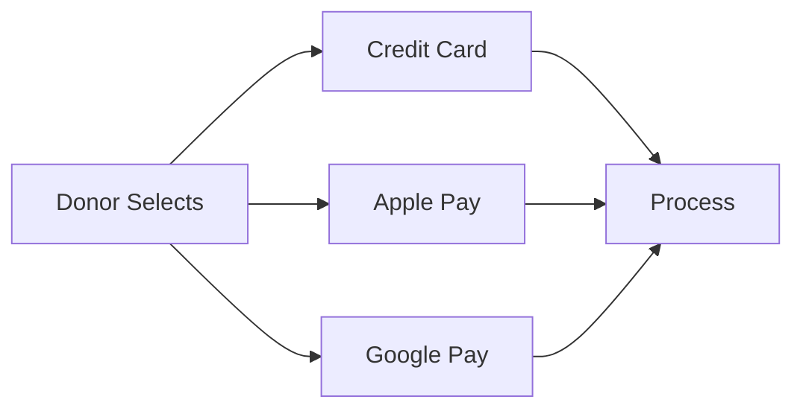

## Overview

Givable provides powerful tools to help nonprofits create engaging donation experiences. You can customize forms, launch campaigns, set up recurring donations, and support multiple payment methods. These features streamline fundraising and boost donor retention.

<Callout kind="info">
Review these core features to get started with your nonprofit's online giving strategy. Customize them to match your organization's branding and goals.
</Callout>

<Image
  src="https://www.givable.com/wp-content/uploads/2025/10/gvbl_donation_form.jpg"
  alt="Screenshot of Givable's customizable online donation form for nonprofits"
  width="800"
  height="450"
/>

## Key Features

Explore the essential capabilities at a glance.

<Columns cols={2}>
  <Card title="Custom Donation Forms" icon="edit-3" href="#custom-forms">
    Tailor forms to your brand with drag-and-drop builders.
  </Card>
  <Card title="Fundraising Campaigns" icon="zap" href="#campaigns">
    Launch targeted drives with real-time tracking.
  </Card>
  <Card title="Recurring Giving" icon="repeat" href="#recurring">
    Convert one-time donors to sustainers effortlessly.
  </Card>
  <Card title="Payment Options" icon="credit-card" href="#payments">
    Support popular methods like cards and Apple Pay.
  </Card>
</Columns>

## Customizing Donation Forms

Build flexible forms that match your nonprofit's needs.

### Quick Setup Steps

<Steps>
  <Step title="Access Form Builder" icon="edit">
    Log in to your Givable dashboard and navigate to Forms > New Form.
  </Step>
  <Step title="Add Fields" icon="plus">
    Drag in fields like amount, donor info, and custom messages.
  </Step>
  <Step title="Style and Preview" icon="monitor">
    Apply your brand colors and preview on desktop/mobile.
  </Step>
  <Step title="Publish" icon="globe">
    Generate embed code or share the hosted link.
  </Step>
</Steps>

<CodeGroup tabs="HTML,React">
  ```html
  <iframe
    src="https://donate.givable.com/your-form-id"
    width="100%"
    height="800"
    frameborder="0">
  </iframe>
  ```
  ```jsx
  import { GivableForm } from '@givable/react';

  function DonationForm() {
    return (
      <GivableForm formId="your-form-id" />
    );
  }
  ```
</CodeGroup>

## Launching Fundraising Campaigns

Create campaigns that drive results.

<Tabs>
  <Tab title="Campaign Dashboard" icon="bar-chart-3">
    Track progress with built-in analytics.

    ```javascript
    // Fetch campaign data via API
    const response = await fetch('https://api.example.com/v1/campaigns/123', {
      headers: { Authorization: `Bearer ${YOUR_API_KEY}` }
    });
    const data = await response.json();
    console.log(data.totalRaised); // e.g., 5000
    ```
  </Tab>
  <Tab title="Email Integration" icon="mail">
    Connect with SendGrid for automated updates.

    <ParamField header="Authorization" param-type="string" required="true">
      SendGrid API key.
    </ParamField>
  </Tab>
</Tabs>

## Configuring Recurring Giving Schedules

Turn one-time gifts into ongoing support.

<Expandable title="Schedule Options" default-open="true">
  Set intervals for monthly, quarterly, or annual giving. Use the dashboard to define:

  | Interval   | Minimum Amount | Example Use Case          |
  |------------|----------------|---------------------------|
  | Monthly    | `{50}`         | Sustainer programs        |
  | Quarterly  | `{100}`        | Seasonal campaigns        |
  | Annual     | `{500}`        | Major donor commitments   |

  Enable gift upgrades on checkout forms to prompt recurring options.
</Expandable>

<Image
  src="https://www.givable.com/wp-content/uploads/2025/10/gvbl_form_upgrade.jpg"
  alt="Screenshot of Givable's donation form gift upgrade option"
  width="800"
  height="450"
/>

## Implementing Payment Method Options

Offer flexibility to increase conversions.

<Callout kind="tip">
Prioritize popular methods like Apple Pay for mobile donors to reduce cart abandonment.
</Callout>

Supported options include:



### Integration Example

```javascript
// Webhook for payment confirmation
app.post('/webhook/givable', (req, res) => {
  const { event, data } = req.body;
  if (event === 'payment.succeeded') {
    // Update donor records
    console.log(`Payment of {data.amount} received`);
  }
  res.status(200).send('OK');
});
```

<Columns cols={3}>
  <Card title="Next Steps" icon="arrow-right" href="/quickstart">
    Set up your first form.
  </Card>
  <Card title="Integrations" icon="link" href="/integrations">
    Connect your tools.
  </Card>
  <Card title="API Reference" icon="code" href="/changelog">
    Advanced customization.
  </Card>
</Columns>
